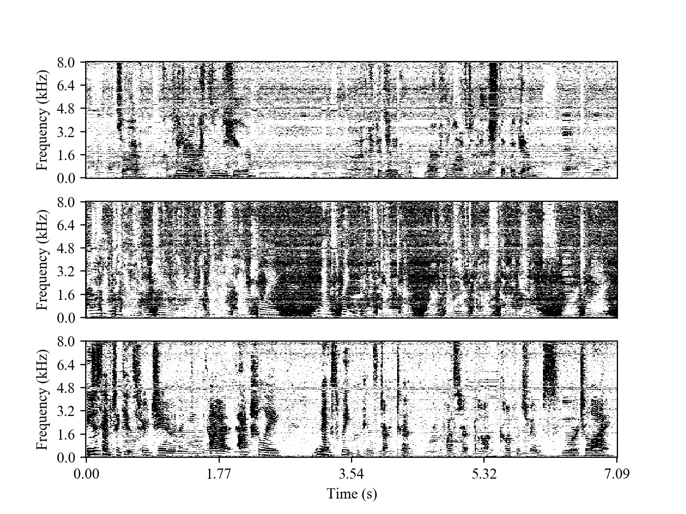

## Spatial Clustering

Time-frequency mask estimation algorithm based on spatial clustering.

### Cmd options

See `./scripts/sptk/estimate_cacgmm_masks.py -h` and `./scripts/sptk/estimate_cgmm_masks.py -h`

### Usage

1. Blind Speech Separation
    ```bash
    echo "2spk asset/2spk.wav" | ../../scripts/sptk/estimate_cacgmm_masks.py --num-classes 3 --num-epoches 20 --frame-len 512 - mask
    ```
    This command estimates TF-masks of the three sources (2 active speakers and 1 for noise). The output order of the sources are random and the masks are generated at `mask/2spk.npy`. You can use `./scripts/sptk/visualize_tf_matrix.py` for mask visualization.

    

2. Speech Enhancement
    ```bash
    echo "noisy asset/noisy.wav" | ../../scripts/sptk/estimate_cgmm_masks.py --num-epoches 20 --frame-len 512 - mask
    ```
    This command estimates TF-masks of the (one) source speaker and mask are generated at `mask/noisy.npy`.

    

### Reference

1. T. Higuchi, N. Ito, S. Araki, et al. Online Mvdr Beamformer Based on Complex Gaussian Mixture Model with Spatial Prior for Noise Robust Asr[J]. IEEE/ACM Transactions on Audio, Speech, and Language Processing, 2017, 25(4):780–793.

2. N. Ito, S. Araki, T. Nakatani. Complex Angular Central Gaussian Mixture Model for Directional Statistics in Mask-based Microphone Array Signal Processing[C]. 2016 24th European Signal Processing Conference (EUSIPCO), 2016:1153–1157.
